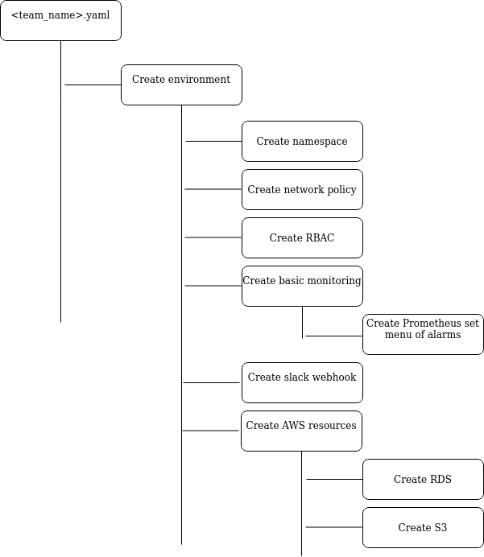

# Cloud Platform Team Operator

## Introduction
This repository will contain the configuration and code to create a prototype Cloud Platform Custom Resource Definition (CRD) and Controller. At present the Cloud Platform on-boards development teams by having them execute a Ruby script in the [cloud-platform-environment](https://github.com/ministryofjustice/cloud-platform-environments) repository and answer some questions depending on their environment. This in turn creates a number of custom manifest files ready to submit a Pull Request. When merged to master a simple pipeline process runs and performs a simple `kubectl apply -f .` command.

During the latest round of Cloud Platform spikes the following issues was created: https://github.com/ministryofjustice/cloud-platform/issues/1701

This issue outlines the desire to move processes inside the Kubernetes ecosystem by extending its API in some way. This repository suggests turning the above process of on-boarding into a simple create and apply manifest solution. 

- [Premise](#premise)
- [Initial Design](#initial-design)
- [Proof of concept](#proof-of-concept)

## Premise
The idea of the Cloud Platform Team CRD and control loop is to allow users to on-board to the MoJ Cloud Platform using a single manifest file. This file will then be applied against the extended API and create an 'vanilla' Cloud Platform environment. An example of this would look like:

```
apiVersion: cloud-platform.service.justice.gov.uk
kind: Team
metadata:
  name: myapp-dev-team
spec:
- environment: dev
    monitoring:
    - basic_alerts: true
      slack_webhook: https://slack.xxxyyyzzz.io
      pingdom_endpoint: https://myapp.dev.gov.uk
    certificates:
    - https://myapp.dev.gov.uk
    resources:
    - aws:
      - rds
        s3
        elasticsearch
        elasticache
      cicd:
        - concourse
          gitops: true
          deploy_every: 30m
```

## Initial Design
This image contains a block diagram in the design of a yaml file. This is subject to change as this process will be evolving over a number of weeks.



## Proof of concept
As there's a timebox on this exercise (maximum time of sprint) I will limit this proof of concept to a basic namespace creation, with RBAC and network policy. The interesting and useful part of this project will exist in the form of multiple CRDs to create external (to the cluster) resources, which comes in the form of concourse pipelines and AWS resources to name a few. This will be left for a later date, should we want to persit with this project.
